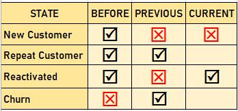

Customer Movement Analysis

### Dataset : Supermarket data 
### SQL : [Google BigQuery](https://console.cloud.google.com/bigquery?orgonly=true&project=crmproject-310907&supportedpurview=organizationId&ws=!1m4!1m3!3m2!1scrmproject-310907!2sSupermarket)

### Customer State

### New Customer : Customers who never appeared in the previous months.
### Repeat Customer - Customers that appear last month and still appear in this month.
### Reactivated : Customers that previous month did not appear but come back and buy in this month.
### Churn Customer - Customers that appear last month but this month did not appear.

## Customer Movement Analysis

