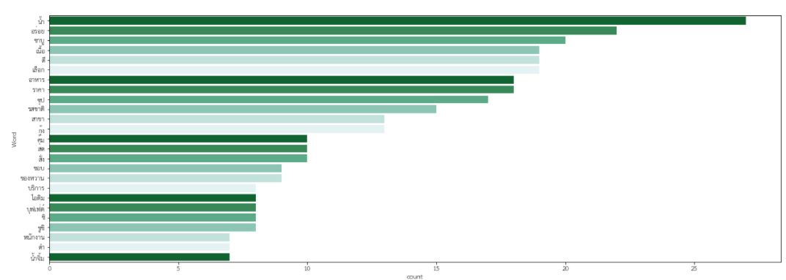
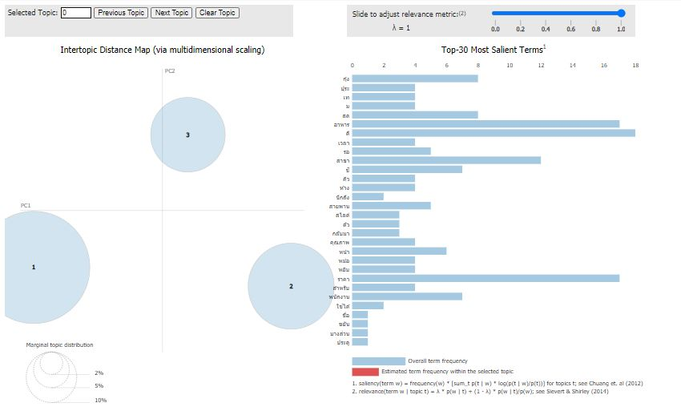
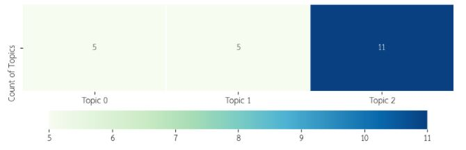
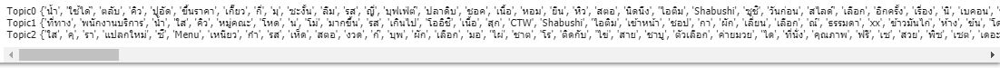

## Voice of Customer
 Show result most words customer feedback reviews on example restaurants

## Data Process
### 1. Cleansing word (Special characteristic, Numeric)
### 2. Use Pythai NLP to sentense of comment and word tokenization. 
### 3. Remove common words by Pythai's stopword corpus and any specify common word.

## LDA Model
LDA Topic modeling to help define number of topics that's most similar word used. 
3 Topics Deifined

## Result
### This Heatmap show the number of customer's reviews have been assigned on each topics.

### Most words of each topics :

